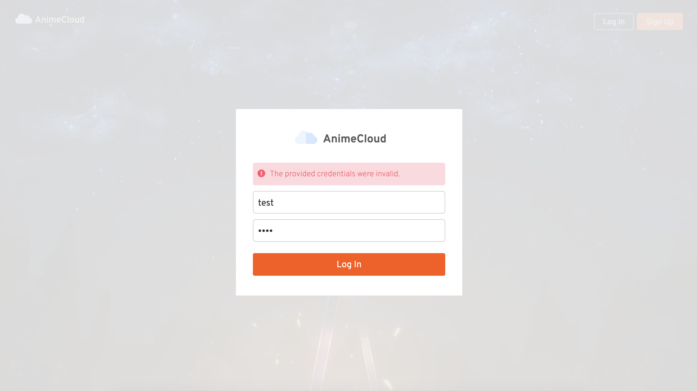
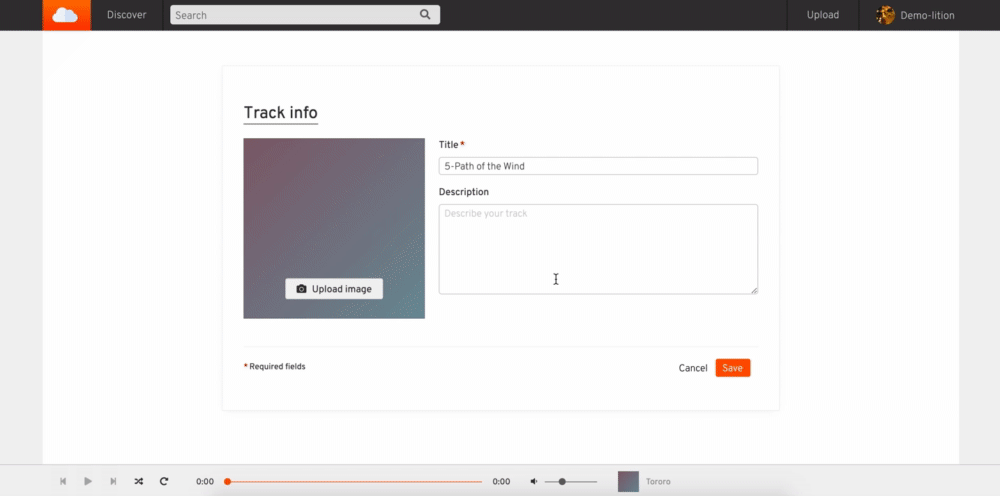
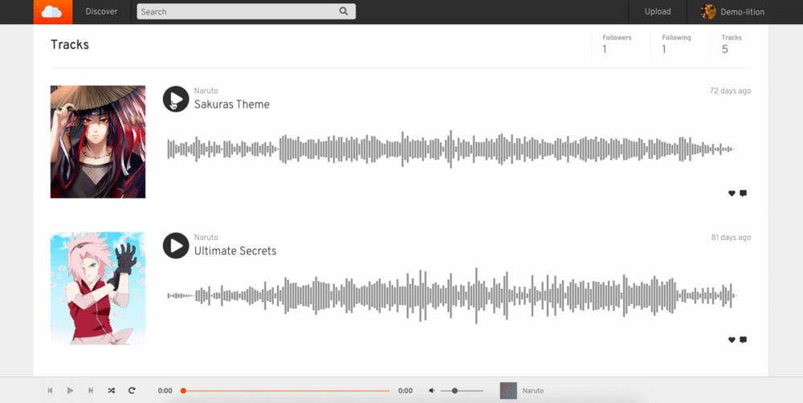

<p align='center'>
  
</p>

## AnimeCloud

* About the project: AnimeCloud is a full-stack SoundCloud clone specifically for Japanese anime songs. 
* View live: [AnimeCloud live app](https://anime-cloud.herokuapp.com/)

<br />

## Table of Contents

  * [Technologies Used](#technologies-used)
  * [Installation](#installation)
  * [Featrues](#features)
  * [Contact](#contact)

<br />

## Technologies Used

  * Languages: 
  * Frontend: 
     
    
    
    
  * Backend:
     
    
    
    

<br />

## Installation

1. Install packages for frontend and backend
```
cd frontend/
npm install
```
```
cd backend/ 
npm install
```
2. Start backend server
```
cd backend/
npm start
```
3. Start frontend server
```
cd frontend/
npm start
```
<br />

## Features

Landing Page Slideshow


<br />

Authentication Errors Handling


<br />

Track Upload



<br />

Play Tracks and Display Waveform


<br />

Playing Status Persist


<br />

## Contact

* Email: [Kimi Zou](mailto:kimizou.kz@gmail.com)
* LinkedIn: [LinkedIn Profile - Kimi Zou](https://www.linkedin.com/in/kimizou/)
* AngelList: [AngelList Profile - Kimi Zou](https://angel.co/u/kimi-zou)
* Github: [Github Profile - Kimi Zou](https://github.com/Kimi-Zou)